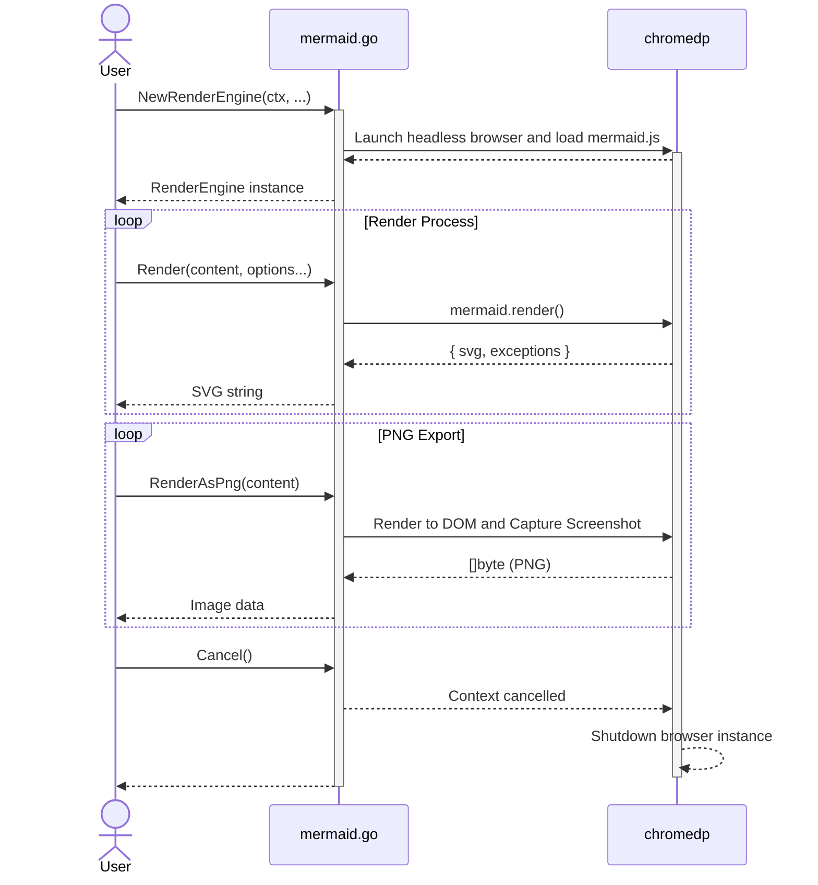

# mermaid.go

[mermaid.go][] is a lightweight Go library that bridges [mermaid.js](https://github.com/mermaid-js/mermaid) and Go, allowing you to generate high-quality diagrams (SVG and PNG) directly from your Go applications.

It works by leveraging [chromedp](https://github.com/chromedp/chromedp) to run a headless Chrome/Chromium instance, providing a robust and accurate rendering environment for all Mermaid diagram types.

For deployments where a browser is unwelcome, a second backend renders through [merman][], a native
Rust implementation of Mermaid — see [Rendering without a browser](#rendering-without-a-browser).

## Prerequisites

The default backend uses `chromedp`, so you must have **Google Chrome** or **Chromium** installed on
your system. The merman backend needs neither: it requires only the `merman-cli` binary on `PATH`.

## Installation

```shell
go get -u github.com/dreampuf/mermaid.go
```

## Architecture



## API Overview

### `NewRenderEngine(ctx context.Context, statements []string, options ...chromedp.ExecAllocatorOption) (*RenderEngine, error)`
Initializes a new render engine by launching a headless browser and loading `mermaid.js`. 
- `statements`: Optional JavaScript statements to execute during initialization (e.g., custom mermaid configuration).
- `options`: Variadic list of `chromedp` allocator options.

If `ctx` has no deadline, loading the bundle and running `statements` is bounded by
`DefaultStartupTimeout` (60s); pass a context with a deadline to choose your own. Note that
`chromedp`'s `WSURLReadTimeout` only covers reading the DevTools URL from chrome's stderr, not this
work. Bear in mind that `ctx` also governs the **engine's whole lifetime**, so for a long-lived
engine prefer `context.Background()` and let each render carry its own deadline.

### `Render(content string, opts ...RenderOption) (string, error)`
Renders a Mermaid diagram source into an SVG string.
- `WithBundle()`: An option to include the original Mermaid source code within a `<desc>` tag in the generated SVG. SVG only — passing it to a PNG method returns `ErrUnsupportedOption` rather than being silently ignored.
- `WithTimeout(d time.Duration)`: An option to override the render deadline for this call. `d <= 0` disables it.

### `RenderAsPng(content string, opts ...RenderOption) ([]byte, *BoxModel, error)`
Renders a Mermaid diagram source into a PNG image. Returns the raw PNG bytes and the diagram's bounding box dimensions. On failure it returns no image and no box model, so a partial screenshot cannot be mistaken for a complete one.

### `RenderAsScaledPng(content string, scale float64, opts ...RenderOption) ([]byte, *BoxModel, error)`
Renders a Mermaid diagram into a scaled PNG image. Useful for generating high-resolution outputs.

### `RenderContext`, `RenderAsPngContext`, `RenderAsScaledPngContext`
Context-aware equivalents of the three methods above, taking `ctx context.Context` as the first
argument. Use these from a server: the context covers **the wait for other renders as well as the
render itself**, so an abandoned request stops consuming a slot. Renders are serialised on one
browser tab, and the render deadline only starts once a render begins, so without a context the
queueing wait is unbounded no matter how short the timeout.

`ctx`'s deadline applies whenever it is sooner than the engine's render timeout, and its
cancellation is propagated. Only cancellation and the deadline are taken from `ctx` — its values are
not, because the render has to run on chromedp's own context.

```go
svg, err := re.RenderContext(req.Context(), content)
```

### `SetRenderTimeout(d time.Duration)`
Overrides `DefaultRenderTimeout` (30s) for subsequent renders. Every render runs on its own
deadline derived from the engine context, so a page that never settles — or a screenshot that
waits on a node chrome never reports as visible — fails with `context.DeadlineExceeded` instead
of blocking forever. A timed out render does not invalidate the engine; the next one proceeds
normally. Pass `d <= 0` to disable the deadline and rely on the engine context alone.

### `SetTargetCrashedHandler(fn func(error))`
Registers a callback for chrome's `Inspector.targetCrashed` notification (and for a detach with an
unexpected reason, such as `Render process gone.`), so a crashed browser is reported rather than
observed as a timeout. `fn` receives an error wrapping `ErrTargetCrashed`, annotated with chrome's
detach reason when one is supplied. It runs on chromedp's event goroutine: it must return promptly
and must not call back into the engine — hand the error to a logger or a buffered channel. A panic
in `fn` is recovered rather than being allowed to take the process down, but it is then discarded,
so do not rely on it surfacing anywhere.
Because chrome reports the crash and its reason as separate events, `fn` may be called more than
once per crash, each time with more detail.

### `CrashError() error`
Returns the recorded crash error, or `nil` if the target is healthy. Renders that fail while the
target is crashed return the underlying chromedp error joined with this one, so
`errors.Is(err, ErrTargetCrashed)` distinguishes a dead browser from a slow diagram. The state
clears if chrome reloads the target after the crash.

### `Cancel()`
Closes the underlying browser instance and releases all associated resources. It does not wait for
an in-flight render: it aborts one, rather than queueing behind it. Every subsequent render fails
with `ErrEngineClosed`.

## Errors

Failures are classified with sentinel errors so callers can branch with `errors.Is` instead of
matching on messages — which matters mainly for deciding whether a retry is worthwhile:

| Error | Meaning | Retry? |
| --- | --- | --- |
| `ErrRenderException` | The backend rejected the diagram source. Both backends use it, and each leaves its own detail reachable via `errors.As`: Chrome a `*runtime.ExceptionDetails` (it raises a genuine JavaScript exception, with the script location and stack), merman a `*MermanExitError`. | No — it will fail identically |
| `ErrTargetCrashed` | Chrome died. Joined to the underlying error, and reported to `SetTargetCrashedHandler`. | Yes, on a fresh engine |
| `context.DeadlineExceeded` | The render, or the wait for a turn, outran its deadline. | Maybe |
| `ErrUnsupportedOption` | A `RenderOption` the called method cannot honour, e.g. `WithBundle()` on a PNG. | No — fix the call |
| `ErrFailedEncoding` | The diagram source could not be JSON-encoded. Wraps the underlying error. | No |
| `ErrMermaidNotReady` | `mermaid.js` did not initialise. The message names what `typeof mermaid` actually was. | No |
| `ErrEngineClosed` | The engine's context is done, because `Cancel()` was called or the context passed to `NewRenderEngine` was cancelled. Without it this is indistinguishable from a cancelled caller, yet it needs the opposite response. | No — build a new engine |

The merman backend reports the same `ErrRenderException`, `ErrUnsupportedOption`,
`ErrEngineClosed` and `context.DeadlineExceeded`, plus three of its own:

| Error | Meaning | Retry? |
| --- | --- | --- |
| `ErrMermanUnavailable` | The `merman-cli` binary was not found, or could not answer the capability probe. Only `NewMermanEngine` returns it. | No — fix the installation |
| `ErrMermanCapability` | The binary was built without a feature the call needs, e.g. PNG output. | No — install a different build |
| `ErrMermanFailed` | merman failed for a reason other than an invalid diagram: a rejected command line, an unusable configuration file, an operational failure, or unusable output. Carries its stderr. | Maybe |

`errors.As` recovers a `*MermanExitError` (`Bin`, `Code`, `Stderr`) whenever a merman process is what
failed. It is worth reaching for, because the exit codes do not partition failures perfectly on every
release: 0.7.0 exits 1 for a missing or malformed configuration file as well as for an invalid
diagram, and only the status and the diagnostics tell those apart. 0.8 fixed that — configuration
errors moved to exit 2 — but the status stays exposed rather than assumed. `NewMermanEngine` reads the file
given to `WithMermanConfigFile` up front for exactly that reason — so the mistake it *can* catch
fails once, honestly, instead of making every render look like a bad diagram. A file smuggled in
through `WithMermanArgs` is still merman's to reject.

## Example

```go
package main

import (
	"context"
	"log"
	"os"

	"github.com/dreampuf/mermaid.go"
)

func main() {
	ctx := context.Background()
	// Initialize the engine
	re, err := mermaid_go.NewRenderEngine(ctx, nil)
	if err != nil {
		panic(err)
	}
	defer re.Cancel()

	// Learn why a render failed when the browser itself went away
	re.SetTargetCrashedHandler(func(err error) {
		log.Printf("mermaid render engine unusable: %v", err)
	})

	content := "graph TD; A-->B;"

	// Render as SVG with the original source bundled
	svg, err := re.Render(content, mermaid_go.WithBundle())
	if err != nil {
		panic(err)
	}
	os.WriteFile("diagram.svg", []byte(svg), 0644)

	// Render as high-res PNG
	png, _, err := re.RenderAsScaledPng(content, 2.0)
	if err != nil {
		panic(err)
	}
	os.WriteFile("diagram.png", png, 0644)
}
```

## Rendering without a browser

[merman][] is a native (Rust) implementation of Mermaid that parses, lays out and renders diagrams
without a browser or a JavaScript runtime. `NewMermanEngine` drives its CLI, so an engine costs one
capability probe to start instead of a Chrome launch, and a deployment needs only the `merman-cli`
binary — no Chrome, no `mermaid.js` bundle.

Bear in mind that merman is a *reimplementation* of Mermaid, not Mermaid itself: it targets a pinned
Mermaid baseline (`MermaidVersion()` reports which) and its SVG is not byte-identical to the browser
backend's. `NewRenderEngine` remains the reference implementation.

```go
re, err := mermaid_go.NewMermanEngine(context.Background())
if err != nil {
    panic(err) // e.g. errors.Is(err, mermaid_go.ErrMermanUnavailable): merman-cli is not installed
}
defer re.Cancel()

svg, err := re.Render("graph TD; A-->B;", mermaid_go.WithBundle())
```

Both engines satisfy the `Renderer` interface — `Render`, `RenderAsPng`, `RenderAsScaledPng`, their
`Context` variants, `SetRenderTimeout` and `Cancel` — so a program can choose a backend at startup
and pass the result around:

```go
var re mermaid_go.Renderer
if *noBrowser {
    re, err = mermaid_go.NewMermanEngine(ctx)
} else {
    re, err = mermaid_go.NewRenderEngine(ctx, nil)
}
```

Chrome's crash reporting (`SetTargetCrashedHandler`, `CrashError`) stays off the interface, as does
merman's `Version`/`MermaidVersion`/`Binary`/`Capabilities`; nothing corresponds on the other side.

### `NewMermanEngine(ctx context.Context, opts ...MermanOption) (*MermanEngine, error)`

Locates the binary and asks it what it is, so a missing or unusable install fails here rather than
on the first render. As with `NewRenderEngine`, `ctx` governs the engine's **whole lifetime**: the
engine context is derived from it, so a deadline on `ctx` does not merely bound start-up — when it
passes, the engine closes and every later render fails with `ErrEngineClosed`. Prefer
`context.Background()` for a long-lived engine and let each render carry its own deadline; use
`WithMermanStartupTimeout` to bound only the probe.

| Option | Effect |
| --- | --- |
| `WithMermanBinary(path)` | The executable to run, as a path or a name on `PATH`. Default: `merman-cli`, then `merman`. |
| `WithMermanSvgID(id)` | Root `<svg>` id and marker prefix. Default `"mermaid"`, matching the browser backend. |
| `WithMermanTheme(name)` | Mermaid theme, the equivalent of a `mermaid.initialize({theme: ...})` statement. |
| `WithMermanConfigFile(path)` | JSON Mermaid configuration file — the closest equivalent to `NewRenderEngine`'s `statements`, which have no JavaScript context to run in here. Read and checked for well-formed JSON at construction. |
| `WithMermanArgs(args...)` | Extra arguments appended to every render, for the parts of merman's command line this package does not model (resource profiles, icon packs, layout viewport). |
| `WithMermanConcurrency(n)` | How many merman processes may run at once. Default: `GOMAXPROCS`. |
| `WithMermanStartupTimeout(d)` | Bounds the capability probe when `ctx` has no deadline. Default: `DefaultStartupTimeout`. |

### merman versions

Tested against both generations. CI pins **0.8.0-alpha.6**, whose Mermaid baseline is 11.17.2, and
**0.7.0**, the current stable release, is supported through the probe's fallback path. Note that the
0.8 linux binaries need glibc 2.38 or newer — 0.7.0's run on older distributions.

The probe prefers `capabilities --json`, which is authoritative about the compiled feature set, and
falls back to `--version` on releases that predate that command — 0.7.0 among them. Those releases
accept every argument this package builds and render identically; all the fallback gives up is the
catalogue, so `Capabilities()` returns `nil` (unknown, not empty) and `MermaidVersion()` is empty.
A `nil` catalogue is never read as *absent*: `RenderAsPng` attempts the render and lets merman
answer, rather than refusing on a promise the binary never made.

The two generations also differ in what an exit status means, which is why `MermanExitError` exposes
it rather than this package inferring from it: 0.7.0 exits 1 for a bad configuration file, the same
status as an invalid diagram, while 0.8 moved configuration errors to 2 and left 1 to mean invalid
content alone.

### Differences from the browser backend

- **Concurrency.** Renders are separate processes, so they run in parallel up to
  `WithMermanConcurrency`, rather than being serialised onto one browser tab. The wait for a slot is
  still covered by the caller's context.
- **Timeouts.** `SetRenderTimeout` and `WithTimeout` work the same way, enforced by killing the
  process. A timed-out render does not invalidate the engine.
- **PNG.** `RenderAsScaledPng` maps to merman's `--scale`. The returned `*BoxModel` is derived from
  the image — width and height only, in CSS pixels as Chrome reports them (the image's pixel size
  divided by `scale`) — because merman reports no layout box.
- **`WithBundle()`.** The source is spliced into the SVG's `<desc>` here rather than through the DOM;
  the result is the same, and it is still rejected for PNG with `ErrUnsupportedOption`.
- **PDF, JPEG, ASCII.** merman can produce these, but this package exposes only SVG and PNG. Reach
  for `merman-cli` directly if you need the rest.

## How to build locally

1. Checkout the code base:
   `git clone https://github.com/dreampuf/mermaid.go.git`
2. Fetch the latest version of `mermaid.js` (optional, as it's already embedded):
    `curl -LO https://unpkg.com/mermaid/dist/mermaid.min.js`
3. Run tests:
   `go test -v ./...`

   The merman tests run against a scripted stand-in binary, so they need nothing installed. The
   subtests that exercise a *real* merman (`TestMermanEngine_LiveRender`, `TestMermanEngine_LivePng`)
   skip unless `merman-cli` is on `PATH` — CI installs it, and locally the
   [release binaries](https://github.com/Latias94/merman/releases) or `cargo install merman-cli` will
   do.

## License

- [mermaid.go][]: MIT License
- [mermaid.js][]: MIT License
- [chromedp]: MIT License
- [merman][]: optional, invoked as an external binary; see its repository for terms
 
[mermaid.go]: https://github.com/dreampuf/mermaid.go
[merman]: https://github.com/Latias94/merman
[mermaid.js]: https://mermaid-js.github.io/mermaid/
[chromedp]: https://github.com/chromedp/chromedp

