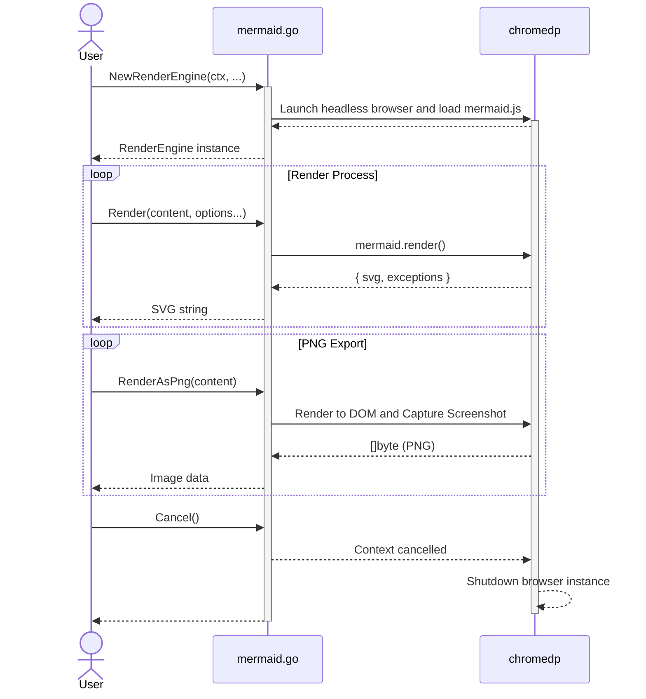

# mermaid.go

[mermaid.go][] is a lightweight Go library that bridges [mermaid.js](https://github.com/mermaid-js/mermaid) and Go, allowing you to generate high-quality diagrams (SVG and PNG) directly from your Go applications.

It works by leveraging [chromedp](https://github.com/chromedp/chromedp) to run a headless Chrome/Chromium instance, providing a robust and accurate rendering environment for all Mermaid diagram types.

## Prerequisites

Since this library uses `chromedp`, you must have **Google Chrome** or **Chromium** installed on your system.

## Installation

```shell
go get -u github.com/dreampuf/mermaid.go
```

## Architecture



## API Overview

### `NewRenderEngine(ctx context.Context, statements []string, options ...chromedp.ExecAllocatorOption) (*RenderEngine, error)`
Initializes a new render engine by launching a headless browser and loading `mermaid.js`. 
- `statements`: Optional JavaScript statements to execute during initialization (e.g., custom mermaid configuration).
- `options`: Variadic list of `chromedp` allocator options.

### `Render(content string, opts ...RenderOption) (string, error)`
Renders a Mermaid diagram source into an SVG string.
- `WithBundle()`: An option to include the original Mermaid source code within a `<desc>` tag in the generated SVG.
- `WithTimeout(d time.Duration)`: An option to override the render deadline for this call. `d <= 0` disables it.

### `RenderAsPng(content string, opts ...RenderOption) ([]byte, *BoxModel, error)`
Renders a Mermaid diagram source into a PNG image. Returns the raw PNG bytes and the diagram's bounding box dimensions.

### `RenderAsScaledPng(content string, scale float64, opts ...RenderOption) ([]byte, *BoxModel, error)`
Renders a Mermaid diagram into a scaled PNG image. Useful for generating high-resolution outputs.

### `SetRenderTimeout(d time.Duration)`
Overrides `DefaultRenderTimeout` (30s) for subsequent renders. Every render runs on its own
deadline derived from the engine context, so a page that never settles — or a screenshot that
waits on a node chrome never reports as visible — fails with `context.DeadlineExceeded` instead
of blocking forever. A timed out render does not invalidate the engine; the next one proceeds
normally. Pass `d <= 0` to disable the deadline and rely on the engine context alone.

### `SetTargetCrashedHandler(fn func(error))`
Registers a callback for chrome's `Inspector.targetCrashed` notification (and for a detach with an
unexpected reason, such as `Render process gone.`), so a crashed browser is reported rather than
observed as a timeout. `fn` receives an error wrapping `ErrTargetCrashed`, annotated with chrome's
detach reason when one is supplied. It runs on chromedp's event goroutine: it must return promptly
and must not call back into the engine — hand the error to a logger or a buffered channel.
Because chrome reports the crash and its reason as separate events, `fn` may be called more than
once per crash, each time with more detail.

### `CrashError() error`
Returns the recorded crash error, or `nil` if the target is healthy. Renders that fail while the
target is crashed return the underlying chromedp error joined with this one, so
`errors.Is(err, ErrTargetCrashed)` distinguishes a dead browser from a slow diagram. The state
clears if chrome reloads the target after the crash.

### `Cancel()`
Closes the underlying browser instance and releases all associated resources.

## Example

```go
package main

import (
	"context"
	"log"
	"os"

	"github.com/dreampuf/mermaid.go"
)

func main() {
	ctx := context.Background()
	// Initialize the engine
	re, err := mermaid_go.NewRenderEngine(ctx, nil)
	if err != nil {
		panic(err)
	}
	defer re.Cancel()

	// Learn why a render failed when the browser itself went away
	re.SetTargetCrashedHandler(func(err error) {
		log.Printf("mermaid render engine unusable: %v", err)
	})

	content := "graph TD; A-->B;"

	// Render as SVG with the original source bundled
	svg, err := re.Render(content, mermaid_go.WithBundle())
	if err != nil {
		panic(err)
	}
	os.WriteFile("diagram.svg", []byte(svg), 0644)

	// Render as high-res PNG
	png, _, err := re.RenderAsScaledPng(content, 2.0)
	if err != nil {
		panic(err)
	}
	os.WriteFile("diagram.png", png, 0644)
}
```

## How to build locally

1. Checkout the code base:
   `git clone https://github.com/dreampuf/mermaid.go.git`
2. Fetch the latest version of `mermaid.js` (optional, as it's already embedded):
    `curl -LO https://unpkg.com/mermaid/dist/mermaid.min.js`
3. Run tests:
   `go test -v ./...`

## License

- [mermaid.go][]: MIT License
- [mermaid.js][]: MIT License
- [chromedp]: MIT License
 
[mermaid.go]: https://github.com/dreampuf/mermaid.go
[mermaid.js]: https://mermaid-js.github.io/mermaid/
[chromedp]: https://github.com/chromedp/chromedp

